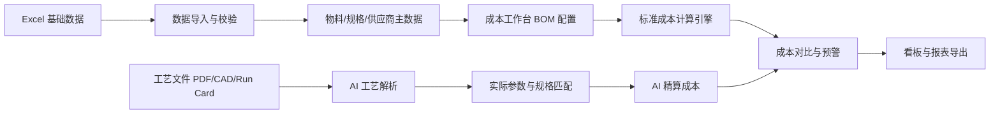

# OSAT 封装成本智能计算系统 Workdown 文档

## 1. 文档目标

本文档基于《OSAT 封装成本智能计算系统 PRD》拆解研发工作项，用于指导产品设计、系统架构、后端开发、前端开发、AI 能力建设、测试验收与上线交付。

系统目标是将传统 Excel 单耗公式管理升级为系统化成本核算平台，围绕“物料编码 + 规格型号”建立成本计算、供应商切换、AI 工艺精算、经营看板和报价导出能力。

## 2. 总体交付范围

| 模块 | 交付目标 | 优先级 |
| --- | --- | --- |
| 基础数据管理 | 支持物料价格、标准 UPH、标准单耗三类 Excel 批量导入与动态更新 | P0 |
| 成本工作台 | 支持引线框架、芯片、键合丝、塑封料等复杂工况配置 | P0 |
| 成本计算引擎 | 统一输出元/K 成本，支持主辅料、人工费、制造费用分摊 | P0 |
| 供应商切换 | 按规格型号过滤供应商，并实时刷新成本结果 | P0 |
| AI 工艺解析 | 上传工艺文件，识别关键参数，生成标准成本与实际成本对比 | P1 |
| 数据看板 | 展示 KPI、成本瀑布图、供应商敏感度、标准 VS 实际偏差 | P1 |
| 报表导出 | 支持对外商务版与内部审计版 Excel/PDF 导出 | P1 |
| 权限与审计 | 管理导入、配置、报价、导出等操作权限与追溯记录 | P2 |

## 3. 业务主线拆解

### 3.1 主流程

1. 用户导入基础 Excel 数据。
2. 系统校验并维护规格型号、供应商、价格、UPH、单耗标准。
3. 用户进入成本工作台，选择封装形式和产品 BOM。
4. 系统根据规格型号自动过滤可用供应商。
5. 用户配置多芯片、多线况、塑封 Shot 参数等复杂工况。
6. 成本引擎计算标准元/K 成本。
7. 用户上传工艺文件，AI 解析实际线况、排样、流道残料等参数。
8. 系统输出 Excel 标准成本与 AI 工艺精算成本对比。
9. 管理层在看板查看成本结构、异常溢价和供应商敏感度。
10. 用户导出对外报价单或内部审计报表。

### 3.2 核心数据链路

## 4. 功能模块 Workdown

## 4.1 基础数据管理与 Excel 导入

### 4.1.1 物料主数据及价格表导入

| 工作项 | 说明 | 优先级 | 交付物 |
| --- | --- | --- | --- |
| Excel 模板字段识别 | 识别物料大类、物料编码、规格型号、供应商名称、采购单价、计价单位 | P0 | 导入字段映射配置 |
| 主键规则实现 | 以物料编码 + 规格型号 + 供应商作为价格记录识别依据 | P0 | 主数据入库逻辑 |
| 多供应商绑定 | 同一规格型号允许绑定多个供应商与不同价格 | P0 | 供应商价格关系表 |
| 单位标准化 | 支持元/K、元/克、元/公斤，并转换为成本引擎可计算单位 | P0 | 单位换算规则 |
| 重复数据处理 | 支持覆盖更新、跳过、生成冲突报告 | P1 | 导入冲突处理机制 |

### 4.1.2 标准 UPH 路线表导入

| 工作项 | 说明 | 优先级 | 交付物 |
| --- | --- | --- | --- |
| 路线字段导入 | 导入封装形式、工序名称、标准 UPH | P0 | UPH 路线数据表 |
| 工序枚举维护 | 支持划片、装片、键合、塑封、切筋、FT 等工序 | P0 | 工序字典 |
| UPH 合理性校验 | 校验 UPH 是否为空、为 0 或异常极值 | P1 | 校验规则与提示 |
| 制造费用校验引用 | 将 UPH 作为产能占用与制造费用合理性辅助依据 | P2 | 校验接口 |

### 4.1.3 标准单耗对照表导入

| 工作项 | 说明 | 优先级 | 交付物 |
| --- | --- | --- | --- |
| 单耗字段导入 | 导入封装形式、主辅料名称、规格型号、标准单耗量 | P0 | 单耗数据表 |
| 封装形式关联 | 单耗记录必须关联封装形式 | P0 | 封装形式索引 |
| 规格型号强绑定 | 单耗记录必须挂载规格型号，缺失时禁止入库或进入待修正状态 | P0 | 规格校验逻辑 |
| 标准成本底单生成 | 将单耗表作为成本工作台默认 BOM 初始化来源 | P0 | BOM 初始化服务 |

### 4.1.4 导入体验与数据质量

| 工作项 | 说明 | 优先级 | 交付物 |
| --- | --- | --- | --- |
| 拖拽上传 | 支持前端拖拽上传 Excel 文件 | P0 | 上传组件 |
| 导入预览 | 入库前展示解析结果、错误行、重复行、待确认项 | P0 | 导入预览页 |
| 错误报告下载 | 支持下载错误明细 Excel | P1 | 错误报告 |
| 导入历史 | 记录导入人、导入时间、文件名、成功/失败行数 | P1 | 导入日志 |

## 4.2 规格型号与供应商校验

| 工作项 | 说明 | 优先级 | 交付物 |
| --- | --- | --- | --- |
| 规格型号主索引 | 建立规格型号统一索引，供 BOM、报表、AI 结果引用 | P0 | Specification 主数据 |
| 供应商精准过滤 | 成本工作台根据当前规格型号只展示可选供应商 | P0 | 供应商过滤接口 |
| 错配防呆 | 不允许选择与当前规格型号无绑定关系的供应商 | P0 | 前后端校验 |
| 数据追溯 | 报表、看板、AI 解析结果均记录规格型号 | P0 | 追溯字段 |
| 模糊匹配字典 | 支持 `Au 0.8 mil` 到 `Au-0.8mil` 的别名匹配 | P1 | 规格别名表 |

## 4.3 成本工作台

### 4.3.1 工作台基础信息

| 工作项 | 说明 | 优先级 | 交付物 |
| --- | --- | --- | --- |
| 产品/封装选择 | 选择封装形式、产品型号、计算版本 | P0 | 工作台基础表单 |
| BOM 初始化 | 根据封装形式和标准单耗自动生成默认 BOM | P0 | 默认 BOM 生成 |
| 成本实时刷新 | 物料、供应商、单耗变更后实时刷新成本 | P0 | 前端计算触发机制 |
| 版本保存 | 支持保存不同报价版本或工艺版本 | P1 | 版本管理 |

### 4.3.2 引线框架 LF 配置

| 工作项 | 说明 | 优先级 | 交付物 |
| --- | --- | --- | --- |
| 单一主料配置 | 引线框架采用单一主料模式 | P0 | LF 配置区 |
| 供应商选择 | 根据 LF 规格型号展示供应商及元/K 价格 | P0 | 供应商下拉 |
| 单 K 成本计算 | `Cost_LF = P_LF` | P0 | LF 成本计算 |

### 4.3.3 芯片 Die/Wafer 配置

| 工作项 | 说明 | 优先级 | 交付物 |
| --- | --- | --- | --- |
| 动态追加芯片 | 支持添加 Die 1、Die 2 等多芯片配置 | P0 | 主子表组件 |
| 芯片规格维护 | 每颗芯片维护规格型号、单耗、供应商或来源 | P0 | Die 配置表 |
| 删除与排序 | 支持删除芯片行、调整显示顺序 | P1 | 行操作能力 |

### 4.3.4 键合丝 Wire 配置

| 工作项 | 说明 | 优先级 | 交付物 |
| --- | --- | --- | --- |
| 多线况配置 | 支持 Au、Cu 等多组键合线况并存 | P0 | Wire 子表 |
| 线况规格选择 | 每组线况必须维护规格型号 | P0 | 规格选择器 |
| 手工标准单耗 | 支持克/K 维度录入标准单耗 | P0 | 单耗输入 |
| 多线况成本汇总 | `Cost_Wire = Σ(Usage_Wire_i * P_Wire_i)` | P0 | Wire 成本计算 |

### 4.3.5 塑封料 EMC 配置

| 工作项 | 说明 | 优先级 | 交付物 |
| --- | --- | --- | --- |
| Shot 参数录入 | 录入每模塑封料克数和净产品颗数 | P0 | EMC 配置区 |
| EMC 供应商选择 | 根据规格型号过滤供应商 | P0 | 供应商下拉 |
| 单 K 成本计算 | `Cost_EMC = W_shot / Q_shot * P_EMC * 1000` | P0 | EMC 成本计算 |
| 参数合法性校验 | Q_shot 必须大于 0，W_shot 必须大于等于 0 | P0 | 表单校验 |

## 4.4 成本计算引擎

### 4.4.1 主辅料成本计算

| 工作项 | 说明 | 优先级 | 交付物 |
| --- | --- | --- | --- |
| 统一元/K 输出 | 所有成本统一换算为元/K | P0 | 成本单位标准 |
| 材料成本汇总 | 汇总 LF、Die、Wire、EMC、其他辅料成本 | P0 | 材料成本服务 |
| 计算过程留痕 | 保存输入值、价格、单耗、公式版本 | P0 | 成本明细记录 |
| 异常价格处理 | 价格缺失、单位无法换算时提示并阻断报价 | P0 | 计算异常处理 |

### 4.4.2 人工费与制造费用分摊

| 工作项 | 说明 | 优先级 | 交付物 |
| --- | --- | --- | --- |
| 月度费用录入 | 录入人工费、租金、电费、折旧损耗 | P0 | 月度费用表 |
| 封装产量录入 | 录入各封装形式月度实际总产量 K | P0 | 月度产量表 |
| 权重系数维护 | 维护封装形式复杂度权重 W_j | P0 | 权重配置 |
| 当量产量计算 | `Q_total_norm = Σ(Q_j * W_j)` | P0 | 当量产量计算 |
| 单位当量费率 | `Rate_norm = 总费用 / Q_total_norm` | P0 | 费率计算 |
| 单 K 分摊成本 | `Cost_MOH_j = Rate_norm * W_j` | P0 | 分摊成本结果 |

### 4.4.3 成本结果结构

| 成本项 | 说明 |
| --- | --- |
| 主材成本 | 引线框架、芯片、键合丝、塑封料等 |
| 人工分摊 | 按当量产量系数分摊 |
| 制造费用 | 租金、电费、折旧等 |
| 标准总成本 | Excel 标准 BOM 成本 |
| AI 精算总成本 | AI 工艺参数修正后的实际估算成本 |
| 偏差金额 | AI 精算总成本 - 标准总成本 |
| 偏差比例 | 偏差金额 / 标准总成本 |

## 4.5 AI 智能工艺解析

### 4.5.1 文件上传与解析任务

| 工作项 | 说明 | 优先级 | 交付物 |
| --- | --- | --- | --- |
| 文件上传 | 支持 PDF、CAD 图纸截图、Run Card 文件 | P1 | 上传入口 |
| 解析任务队列 | 上传后生成异步解析任务 | P1 | AI 任务表 |
| 解析状态展示 | 展示待解析、解析中、成功、失败 | P1 | 任务状态组件 |
| 文件归档 | 文件与产品、版本、规格型号绑定 | P1 | 文件记录 |

### 4.5.2 AI 参数识别

| 工作项 | 说明 | 优先级 | 交付物 |
| --- | --- | --- | --- |
| 键合图识别 | 识别实际总打线数、平均线长、弧高 | P1 | Wire 解析结果 |
| 排版排样识别 | 识别单片 Strip 颗数、模具流道残料比 | P1 | Layout 解析结果 |
| 文本参数抽取 | 抽取图纸中的线材、规格、封装、工序信息 | P1 | OCR/视觉解析结果 |
| 置信度输出 | 每项识别结果输出置信度 | P1 | 置信度字段 |

### 4.5.3 规格匹配与防错预警

| 工作项 | 说明 | 优先级 | 交付物 |
| --- | --- | --- | --- |
| 语义对齐 | 将图纸文本模糊匹配到系统规格型号 | P1 | 规格匹配服务 |
| 冲突识别 | 对比 AI 识别规格与 BOM 规格 | P1 | 冲突检测规则 |
| 强警告提示 | 重大材质错配时高亮提示 | P1 | 预警组件 |
| 人工确认 | 低置信度或冲突项支持人工确认 | P1 | 确认流程 |

### 4.5.4 AI 精算成本

| 工作项 | 说明 | 优先级 | 交付物 |
| --- | --- | --- | --- |
| 实际单耗修正 | 根据线长、打线数、排样参数修正单耗 | P1 | 精算单耗模型 |
| 标准/实际对比 | 左右分栏展示 Excel 标准成本与 AI 精算成本 | P1 | 对比界面 |
| 溢价点标记 | 标记造成成本上升的物料或工序 | P1 | 偏差分析 |
| 解析备注入报表 | 报表中附带 AI 提取参数与备注 | P1 | 报表备注字段 |

## 4.6 多维度数据看板

### 4.6.1 KPI 指标卡

| 指标 | 计算逻辑 | 优先级 |
| --- | --- | --- |
| 全厂平均单 K 封测成本 | 月度总投入 / 实际总产量 | P1 |
| 高价值贵金属主材水位线 | 金丝、银浆等成本 / 当前生产总成本 | P1 |
| AI 工艺溢价报警数 | 实际成本显著高于标准成本的产品数量 | P1 |

### 4.6.2 管理图表

| 图表 | 说明 | 优先级 |
| --- | --- | --- |
| 封装形式成本瀑布图 | 展示框架、键合丝、塑封料、人工、制造费用到总成本的构成 | P1 |
| 供应商切换敏感度折线图 | 模拟未来三个月切换供应商后的单 K 成本走势 | P1 |
| 标准 VS 实际成本偏差散点图 | X 轴标准成本，Y 轴 AI 精算/实际成本，高偏差产品高亮 | P1 |

## 4.7 报表与导出

### 4.7.1 对外商务版报价单

| 工作项 | 说明 | 优先级 | 交付物 |
| --- | --- | --- | --- |
| 毛利率配置 | 支持输入目标毛利率 | P1 | 毛利率输入 |
| 建议报价计算 | 根据总单 K 成本生成建议报价 | P1 | 报价公式 |
| 敏感项隐藏 | 隐去制造费用、人工明细、内部成本拆分 | P1 | 商务版模板 |
| Excel/PDF 导出 | 输出 Excel 或 PDF | P1 | 导出文件 |

### 4.7.2 内部审计版报表

| 工作项 | 说明 | 优先级 | 交付物 |
| --- | --- | --- | --- |
| 成本明细展开 | 展示主材、辅料、人工、制造费用明细 | P1 | 审计版模板 |
| 工艺参数备注 | 附带 AI 提取的线长、打线数、残料比等参数 | P1 | AI 备注区 |
| 版本追溯 | 展示计算版本、数据来源、导入批次 | P1 | 追溯信息 |
| 导出权限控制 | 内部审计版仅授权角色可导出 | P2 | 权限校验 |

## 5. 数据模型初稿

| 实体 | 关键字段 |
| --- | --- |
| Material | material_id、category、material_code、specification、unit |
| SupplierPrice | material_id、supplier_name、price、price_unit、effective_date |
| PackageType | package_id、package_name、weight_coefficient |
| UPHRoute | package_id、process_name、standard_uph |
| StandardUsage | package_id、material_name、specification、standard_usage、usage_unit |
| CostProject | project_id、product_name、package_id、version、status |
| CostBOMItem | project_id、material_type、specification、supplier_id、usage、usage_unit |
| MonthlyExpense | month、labor_cost、rent_cost、power_cost、depreciation_cost |
| MonthlyOutput | month、package_id、actual_output_k、weight_coefficient |
| CostResult | project_id、version、standard_cost_k、ai_cost_k、variance_amount、variance_rate |
| AIParseTask | task_id、project_id、file_id、status、confidence、result_json |
| ExportRecord | export_id、project_id、export_type、created_by、created_at |

## 6. 接口清单初稿

| 接口 | 方法 | 用途 | 优先级 |
| --- | --- | --- | --- |
| `/api/import/materials` | POST | 导入物料主数据及价格表 | P0 |
| `/api/import/uph-routes` | POST | 导入标准 UPH 路线表 | P0 |
| `/api/import/standard-usages` | POST | 导入标准单耗对照表 | P0 |
| `/api/specifications/{spec}/suppliers` | GET | 按规格型号查询可用供应商 | P0 |
| `/api/cost-projects` | POST | 创建成本计算项目 | P0 |
| `/api/cost-projects/{id}` | GET | 获取成本工作台详情 | P0 |
| `/api/cost-projects/{id}/calculate` | POST | 执行标准成本计算 | P0 |
| `/api/monthly-expenses` | POST | 维护月度费用 | P0 |
| `/api/monthly-outputs` | POST | 维护月度产量与权重 | P0 |
| `/api/ai/parse-tasks` | POST | 上传工艺文件并创建解析任务 | P1 |
| `/api/ai/parse-tasks/{id}` | GET | 查询 AI 解析结果 | P1 |
| `/api/dashboard/kpis` | GET | 查询看板 KPI | P1 |
| `/api/dashboard/charts` | GET | 查询图表数据 | P1 |
| `/api/exports/quotation` | POST | 导出报价单 | P1 |

## 7. 页面与交互拆解

| 页面 | 核心能力 | 优先级 |
| --- | --- | --- |
| 登录与权限入口 | 用户登录、角色识别 | P2 |
| 基础数据导入页 | 拖拽上传、导入预览、错误报告、导入历史 | P0 |
| 物料主数据页 | 查询物料、规格、供应商价格、单位 | P0 |
| 标准 UPH 页 | 维护封装形式工序路线与 UPH | P0 |
| 标准单耗页 | 维护封装形式与规格型号单耗 | P0 |
| 成本工作台 | 配置 LF、Die、Wire、EMC，实时计算成本 | P0 |
| AI 工艺解析页 | 上传文件、查看解析状态、确认冲突项 | P1 |
| 成本对比页 | 左右分栏展示标准成本与 AI 精算成本 | P1 |
| 管理看板 | KPI、瀑布图、折线图、散点图 | P1 |
| 报表导出页 | 选择商务版/审计版并导出 Excel/PDF | P1 |

## 8. 里程碑计划

### M1：基础数据与标准成本 MVP

目标：完成从 Excel 导入到标准成本计算的闭环。

交付内容：

- 三类 Excel 基础表导入。
- 规格型号与供应商过滤。
- 成本工作台基础配置。
- LF、Wire、EMC 主公式计算。
- 人工费与制造费用分摊模型。
- 标准成本结果输出。

验收标准：

- 可导入物料价格、UPH、标准单耗三类 Excel。
- 同一规格型号可绑定多个供应商。
- 供应商下拉只能展示当前规格型号可用供应商。
- 成本结果统一输出元/K。
- 输入样例数据后，系统计算结果与人工 Excel 计算结果一致。

### M2：复杂工况与版本化

目标：支持多芯片、多线况、Shot 参数和报价版本留存。

交付内容：

- Die 1 对多配置。
- Wire 多线况混合配置。
- EMC Shot 参数校验与计算。
- 成本项目版本保存。
- 计算过程留痕。

验收标准：

- 同一产品可配置多个 Die 与多个 Wire 线况。
- 任意供应商或单耗变更后，总成本实时刷新。
- 每次计算可追溯输入、价格、规格型号和公式版本。

### M3：AI 工艺解析与成本对比

目标：实现工艺文件上传、AI 参数提取、规格冲突预警和 AI 精算成本。

交付内容：

- 工艺文件上传与解析任务。
- 键合图、排样图关键参数识别。
- AI 识别规格与 BOM 规格匹配。
- 冲突预警与人工确认。
- 标准成本 VS AI 精算成本对比页。

验收标准：

- 可上传 PDF、截图或 Run Card。
- AI 输出打线数、平均线长、弧高、Strip 颗数或残料比等关键参数。
- 当 AI 识别规格与 BOM 规格冲突时，系统弹出强警告。
- 可展示标准成本和 AI 精算成本差异。

### M4：管理看板与报表导出

目标：面向管理层和财务输出可视化看板与报价报表。

交付内容：

- KPI 指标卡。
- 成本瀑布图。
- 供应商敏感度模拟。
- 标准 VS 实际偏差散点图。
- 对外商务版报价单。
- 内部审计版报表。

验收标准：

- 看板指标可按月、封装形式、供应商筛选。
- 报价单可导出 Excel/PDF。
- 对外商务版隐藏内部成本明细。
- 内部审计版展示完整成本拆解与 AI 参数备注。

## 9. 测试计划

| 测试类型 | 测试重点 | 优先级 |
| --- | --- | --- |
| 导入测试 | 字段缺失、重复数据、单位异常、规格缺失 | P0 |
| 计算测试 | LF、Wire、EMC、人工制造费用公式准确性 | P0 |
| 供应商过滤测试 | 规格型号与供应商绑定关系、防错校验 | P0 |
| 工作台测试 | 多芯片、多线况、动态增删、实时刷新 | P0 |
| AI 解析测试 | 文件上传、参数识别、置信度、冲突预警 | P1 |
| 看板测试 | KPI 口径、图表筛选、异常高亮 | P1 |
| 导出测试 | 商务版隐藏字段、审计版完整字段、Excel/PDF 格式 | P1 |
| 权限测试 | 导入、计算、AI 解析、导出权限边界 | P2 |

## 10. 风险与依赖

| 风险 | 影响 | 应对策略 |
| --- | --- | --- |
| Excel 格式不稳定 | 导入失败或字段错配 | 建立模板版本与字段映射配置 |
| 规格型号命名不统一 | 供应商过滤和 AI 匹配失败 | 建立规格别名表与人工确认流程 |
| 单位换算复杂 | 成本计算失真 | 所有价格和单耗入库前统一标准化 |
| AI 识别置信度不足 | 精算结果不可直接使用 | 输出置信度并要求人工确认关键冲突 |
| 制造费用分摊口径争议 | 管理层不认可成本结果 | 保留权重配置、计算过程和版本留痕 |
| 报价数据敏感 | 内部成本泄露 | 区分导出版式并增加权限控制 |

## 11. 优先级定义

| 优先级 | 定义 |
| --- | --- |
| P0 | MVP 必须交付，缺失则无法完成标准成本计算闭环 |
| P1 | 核心增强能力，支撑 AI 精算、管理看板和报价导出 |
| P2 | 管理、审计、权限、体验优化类能力，可在后续迭代完善 |

## 12. MVP 最小可用范围建议

首版建议优先完成以下能力：

1. Excel 三表导入。
2. 规格型号主数据与供应商过滤。
3. 成本工作台。
4. LF、Wire、EMC 标准成本计算。
5. 月度人工费与制造费用分摊。
6. 标准成本结果明细。
7. 内部版基础 Excel 导出。

AI 解析、管理看板和 PDF 报价可作为第二阶段上线，以降低首版交付风险。

